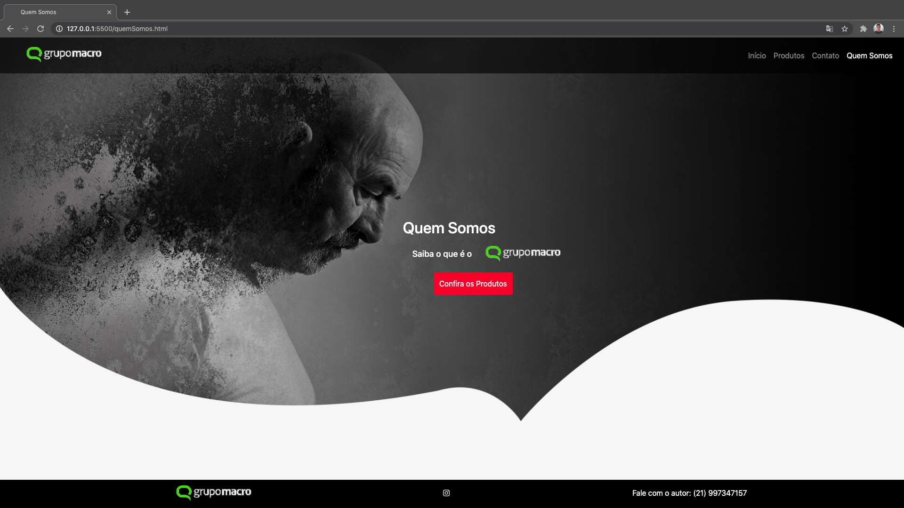

# Agência Macro

# Prazo: 31/07

Explicação do Teste que será aplicado: 
Montar a Home, Página de Produtos, Página de Contato e Página de Quem somos.
O teste será transformar os PSDs enviados em um Wordpress, prezando qualidade de responsividade, código semântico e sua identação. Será um plus analisado caso seja usado no projeto Bootstrap 4/3 para montar o html, mas não será um item obrigatório.
O site deverá conter os produtos como um post personalizado, para fins de teste, e o formulário de contato precisará ser enviado via ajax. Para criação de um tipo de post e o contato não poderá ser usado plugins, para que possamos analisar melhor o código. 

<h1>Home (Desktop)<h1>

<h1>Produtos (Desktop)<h1>

<h1>Contato (Desktop)<h1>

<h1>Quem Somos (Desktop)<h1>

